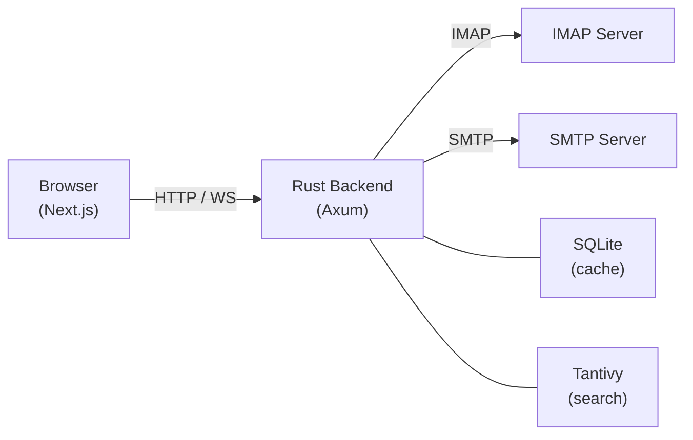

<div align="center">

# Rav

**Modern, fast, and secure open-source webmail client built with React + Rust.**

A feature-complete replacement for Roundcube that connects to any existing IMAP/SMTP mail server.\
Not a mail platform - just a clean, modern webmail UI.

[](https://github.com/naust-mail/rav/actions/workflows/ci.yml)
[](LICENSE)
[](https://github.com/c0h1b4/oxi/stargazers)
[](https://github.com/naust-mail/rav/commits/main)
[](https://ghcr.io/naust-mail/rav)

</div>

---

<!-- Add a screenshot here:  -->

## Features

- **Mail** - Compose, reply, forward, and organize with a rich text editor (Tiptap), tags, folders, saved searches, and multiple send-as identities
- **Contacts and calendar** - Address book with contact groups, iCal event parsing
- **Full-text search** - Instant local search powered by Tantivy
- **Real-time sync** - WebSocket-driven live mailbox updates
- **Security** - PGP (sign/encrypt/verify/decrypt), passkey + TOTP login, IMAP credential auth, session timeouts, rate limiting, HMAC-signed safe link rewriting
- **Automation** - Sieve filters (local and ManageSieve), out-of-office autoresponder, optional rspamd spam/ham training
- **Fast and self-hosted** - Rust backend with per-user SQLite caching, single Docker image, static frontend served from the same binary
- **Stickers** (optional) - Mood-based reaction stickers, enabled via the `stickers` build feature

## Comparison to alternatives

Rav fills a gap - a modern webmail UI without the baggage of a full mail platform.

|                        | Rav             | Roundcube | SOGo        | Mailcow      |
|------------------------|-----------------|-----------|-------------|--------------|
| Backend language       | Rust            | PHP       | Objective-C | PHP / Python |
| Frontend framework     | React / Next.js | jQuery    | Angular     | Vue.js       |
| Modern UI              | Yes             | No        | No          | No           |
| Memory-safe backend    | Yes             | No        | No          | No           |
| Full-text search       | Yes             | No        | Yes         | Yes          |
| No bundled mail server | Yes             | Yes       | Yes         | No           |
| WebSocket live sync    | Yes             | No        | No          | No           |
| Single Docker image    | Yes             | Yes       | No          | No           |
| PGP encryption         | Yes             | Plugin    | No          | No           |
| Passkey / TOTP login   | Yes             | No        | No          | No           |


## Tech Stack

| Layer        | Technology                                                               |
|--------------|--------------------------------------------------------------------------|
| **Frontend** | Next.js 16, React 19, Tailwind CSS 4, Shadcn/ui, Zustand, TanStack Query |
| **Backend**  | Rust, Axum, Tokio, async-imap, Lettre (SMTP)                             |
| **Search**   | Tantivy (Rust-native full-text search)                                   |
| **Database** | SQLite per user (local cache via rusqlite + Refinery migrations)         |
| **Editor**   | Tiptap (rich text compose)                                               |
| **Deploy**   | Docker (GHCR), single binary serves frontend + API                       |

## Quick Start

### Docker (recommended)

```bash
docker run -d \
  --name rav \
  -p 3001:3001 \
  -e IMAP_HOST=mail.example.com \
  -e SMTP_HOST=mail.example.com \
  -v rav-data:/data \
  ghcr.io/naust-mail/rav:latest
```

Or with `docker-compose.yml`:

```yaml
services:
  app:
    image: ghcr.io/naust-mail/rav:latest
    ports:
      - "3001:3001"
    environment:
      - IMAP_HOST=mail.example.com
      - SMTP_HOST=mail.example.com
    volumes:
      - rav-data:/data

volumes:
  rav-data:
```

Then open [http://localhost:3001](http://localhost:3001) and log in with your email credentials.

### Local Development

```bash
# Frontend
cd frontend && bun install && bun run build

# Backend
cd backend && cargo build --release

# Run (serves frontend + API on port 3001)
STATIC_DIR=../frontend/out IMAP_HOST=mail.example.com SMTP_HOST=mail.example.com \
  ./target/release/rav-email-server
```

## Configuration

All configuration is via environment variables. The essentials:

| Variable        | Default    | Description                           |
|------------------|-----------|----------------------------------------|
| `IMAP_HOST`      | none      | IMAP server hostname (**required**)    |
| `SMTP_HOST`      | none      | SMTP server hostname (**required**)    |
| `DATA_DIR`       | `/data`   | Persistent data storage directory      |
| `BASE_PATH`      | none      | Base path prefix for a reverse proxy (e.g. `/rav`) |
| `PGP_ENABLED`    | `true`    | In-browser PGP sign/encrypt/verify/decrypt |
| `WEBAUTHN_RP_ID` | none      | WebAuthn relying party ID; required for passkey login |

<details>
<summary>Advanced configuration</summary>

| Variable                    | Default       | Description                                                                   |
|------------------------------|---------------|--------------------------------------------------------------------------------|
| `HOST`                       | `0.0.0.0`     | HTTP server bind address                                                       |
| `PORT`                       | `3001`        | HTTP server port                                                               |
| `IMAP_PORT`                  | `993`         | IMAP server port                                                               |
| `IMAP_CONNECT_HOST`          | `IMAP_HOST`   | TCP address for IMAP connections; set to `127.0.0.1` on hosts with hairpin NAT |
| `SMTP_PORT`                  | `587`         | SMTP server port                                                               |
| `SMTP_CONNECT_HOST`          | `SMTP_HOST`   | TCP address for SMTP connections, same rationale as `IMAP_CONNECT_HOST`        |
| `TLS_ENABLED`                | `true`        | Enable TLS for mail connections                                                |
| `TLS_CA_CERT_PATH`           | none          | PEM certificate to trust in-process, for self-signed mail server certs         |
| `ALLOW_CUSTOM_MAIL_SERVERS`  | `true`        | If `false`, users cannot override `IMAP_HOST`/`SMTP_HOST` from the UI          |
| `SESSION_TIMEOUT_HOURS`      | `24`          | Session expiry in hours                                                        |
| `STATIC_DIR`                 | `./static`    | Frontend static files directory                                                |
| `ENVIRONMENT`                | `development` | Runtime environment                                                            |
| `WEBAUTHN_RP_ORIGIN`         | none          | WebAuthn relying party origin (e.g. `https://box.example.com`); must match exactly |
| `SIEVE_HOST`                 | none          | ManageSieve server hostname; when set, filters are also pushed as Sieve scripts |
| `SIEVE_PORT`                 | `4190`        | ManageSieve server port                                                        |
| `RSPAMD_URL`                 | none          | Base URL for rspamd's HTTP API; enables spam/ham training when set             |
| `LINK_PROXY_ENABLED`         | `false`       | Rewrite links in rendered emails through an HMAC-signed proxy                  |
| `TRUSTED_PROXIES`            | none          | Comma-separated CIDRs whose forwarded-IP headers are trusted for rate limiting |
| `RUST_LOG`                   | `info`        | Log level filter                                                               |

</details>

## Architecture



## Development

```bash
# Run frontend dev server (hot reload)
cd frontend && bun run dev

# Run backend
cd backend && cargo run

# Run tests
cd frontend && bunx vitest run
cd backend && cargo test

# Lint
cd frontend && bun run lint
cd backend && cargo clippy -- -D warnings
```

## Roadmap

Rav is under active development. Core email functionality (read, compose, search, contacts, calendar), PGP, passkey/TOTP login, and Sieve filters are implemented. Coming next:

- Attachment previews
- Keyboard shortcuts
- Theme customization
- Multi-account support

## Contributing

Contributions are welcome! Please:

1. Fork the repository
2. Create a feature branch (`git checkout -b feat/my-feature`)
3. Commit your changes
4. Open a pull request against `main`

## License

[MIT](LICENSE)

