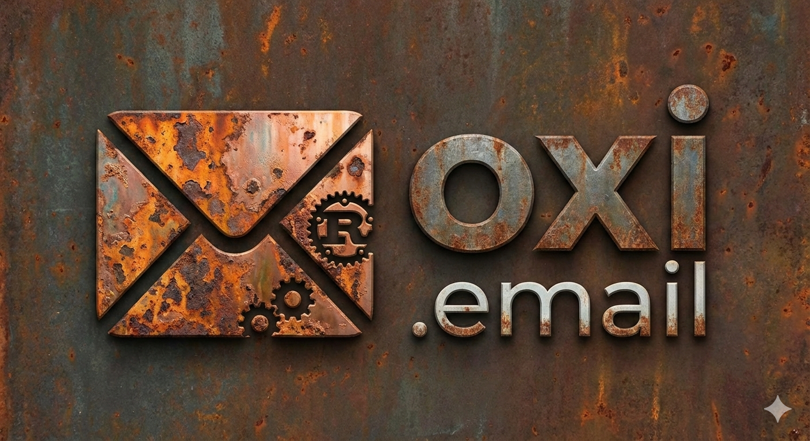
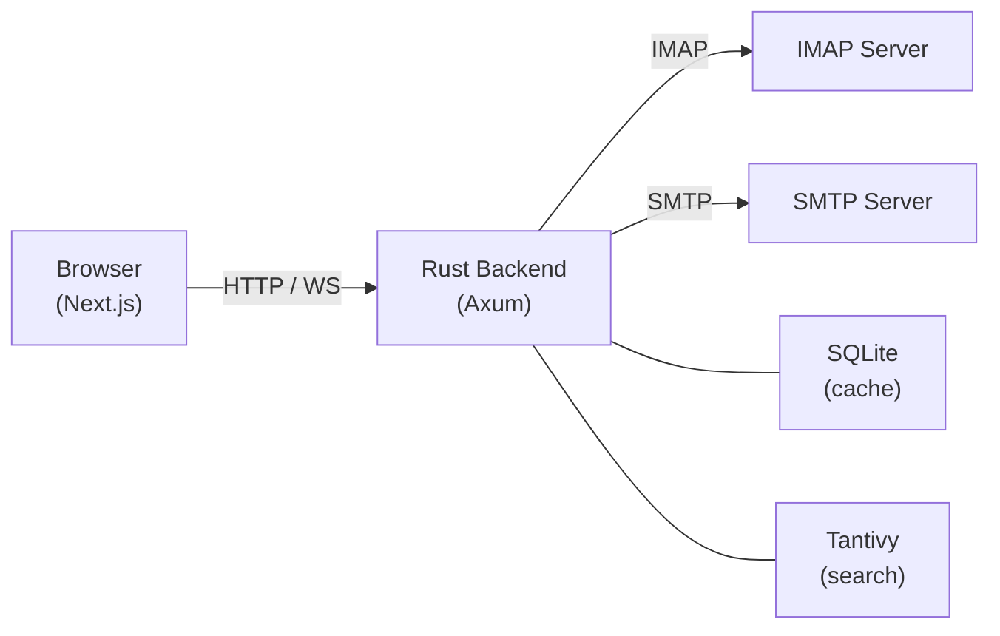

<div align="center">



# oxi

**Modern, fast, and secure open-source webmail client built with React + Rust.**

A feature-complete replacement for Roundcube that connects to any existing IMAP/SMTP mail server.\
Not a mail platform — just a clean, modern webmail UI.

[](https://github.com/c0h1b4/oxi/actions/workflows/ci.yml)
[](LICENSE)
[](https://github.com/c0h1b4/oxi/stargazers)
[](https://github.com/c0h1b4/oxi/commits/main)
[](https://ghcr.io/c0h1b4/oxi)

</div>

---

<!-- Add a screenshot here:  -->

## Features

- **Mail** — Read, compose, reply, forward, and manage emails with a rich text editor (Tiptap)
- **Contacts** — Browse and manage your address book
- **Calendar** — iCal event parsing and calendar view
- **Full-Text Search** — Instant local search powered by Tantivy
- **Real-Time Updates** — WebSocket-driven live mailbox sync
- **Security** — IMAP credential auth, session tokens with configurable timeout, rate limiting
- **Fast** — Rust backend with per-user SQLite caching, static frontend served from the same binary
- **Self-Hosted** — Single Docker image, connects to any IMAP/SMTP server

## Tech Stack

| Layer | Technology |
|-------|-----------|
| **Frontend** | Next.js 16, React 19, Tailwind CSS 4, Shadcn/ui, Zustand, TanStack Query |
| **Backend** | Rust, Axum, Tokio, async-imap, Lettre (SMTP) |
| **Search** | Tantivy (Rust-native full-text search) |
| **Database** | SQLite per user (local cache via rusqlite + Refinery migrations) |
| **Editor** | Tiptap (rich text compose) |
| **Deploy** | Docker (GHCR), single binary serves frontend + API |

## Quick Start

### Docker (recommended)

```bash
docker run -d \
  --name oxi \
  -p 3001:3001 \
  -e IMAP_HOST=mail.example.com \
  -e SMTP_HOST=mail.example.com \
  -v oxi-data:/data \
  ghcr.io/c0h1b4/oxi:latest
```

Or with `docker-compose.yml`:

```yaml
services:
  app:
    image: ghcr.io/c0h1b4/oxi:latest
    ports:
      - "3001:3001"
    environment:
      - IMAP_HOST=mail.example.com
      - SMTP_HOST=mail.example.com
    volumes:
      - oxi-data:/data

volumes:
  oxi-data:
```

Then open [http://localhost:3001](http://localhost:3001) and log in with your email credentials.

### Local Development

```bash
# Frontend
cd frontend && bun install && bun run build

# Backend
cd backend && cargo build --release

# Run (serves frontend + API on port 3001)
STATIC_DIR=../frontend/out IMAP_HOST=mail.example.com SMTP_HOST=mail.example.com \
  ./target/release/oxi-email-server
```

## Configuration

All configuration is via environment variables:

| Variable | Default | Description |
|----------|---------|-------------|
| `HOST` | `0.0.0.0` | HTTP server bind address |
| `PORT` | `3001` | HTTP server port |
| `IMAP_HOST` | — | IMAP server hostname (**required**) |
| `IMAP_PORT` | `993` | IMAP server port |
| `SMTP_HOST` | — | SMTP server hostname (**required**) |
| `SMTP_PORT` | `587` | SMTP server port |
| `TLS_ENABLED` | `true` | Enable TLS for mail connections |
| `DATA_DIR` | `/data` | Persistent data storage directory |
| `SESSION_TIMEOUT_HOURS` | `24` | Session expiry in hours |
| `STATIC_DIR` | `./static` | Frontend static files directory |
| `ENVIRONMENT` | `development` | Runtime environment |
| `BASE_PATH` | — | Base path prefix for reverse proxy (e.g. `/oxi`) |
| `RUST_LOG` | `info` | Log level filter |

## Architecture



## Development

```bash
# Run frontend dev server (hot reload)
cd frontend && bun run dev

# Run backend
cd backend && cargo run

# Run tests
cd frontend && bunx vitest run
cd backend && cargo test

# Lint
cd frontend && bun run lint
cd backend && cargo clippy -- -D warnings
```

## Roadmap

oxi is under active development. Core email functionality (read, compose, search, contacts, calendar) is implemented. Coming next:

- Sieve filter support
- Attachment previews
- Keyboard shortcuts
- Theme customization
- Multi-account support

## Contributing

Contributions are welcome! Please:

1. Fork the repository
2. Create a feature branch (`git checkout -b feat/my-feature`)
3. Commit your changes
4. Open a pull request against `main`

## License

[MIT](LICENSE)

---

<div align="center">

## Star History

[](https://star-history.com/#c0h1b4/oxi&Date)

</div>
